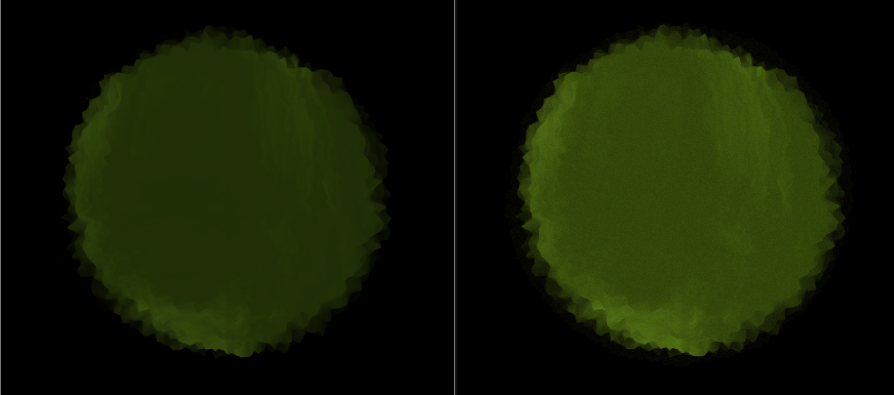
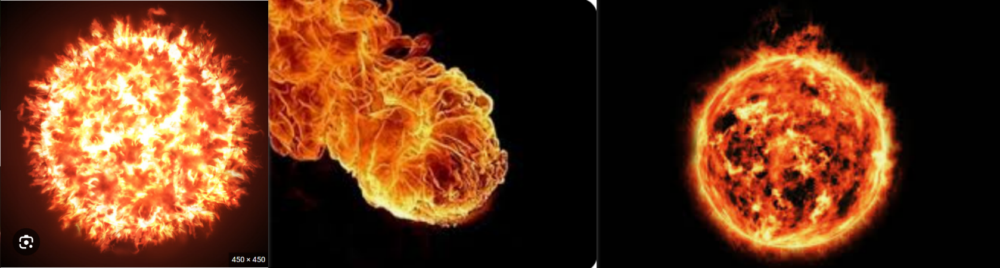

# [Project 1: Noise-Based Fireball](https://github.com/CIS-566-Fall-2022/hw01-fireball-base)
#### Yifan Lu        
#### University of Pennsylvania

#### [Project Link (click me!)](https://lyifaxxx.github.io/hw01-fireball/)


## Introduction
This project is a procedural-generated fireball. Users can toogle several parameters including color, speed, brightness to create a custom fireball.


## Project Feature

### Adjustable Noise-based Shape
The overall shape of the fireball is determined by several types and layers of noise functions which make the shape look dynamic and organic.


### Color the Fireball
Here is a picture to the Real Sun in our Solar system.


The color gradient of the sun from higher temperature to lower looks like this:

```
black - white - yellow - red - black
```

In order to blend/interpolate them in a (scientifically) correct way, I introduced the "fire intensity" mask. It is determined by the followings:

- view direction
- tex coord on sphere surface
- noises (mainly fbm noise)


Because the edge of our fireball should be less intense, it is necessary to consider the view direction.

Many wizards and witchs and magicians perform different types of fire magic. They threatened me to add more colors otherwise they will fireball me. So I use a hue mapping towards the original color which allows them to define a base color from the UI.


### Alpha Control
Fire in the nature will fade into air. The best way I have to achieve this effect is to tweak alpha value accordingly. 

The alpha value is determined by 3 terms:
- The radius of the surface vertex point
- Fire intensity. Higher fire intensity yields smaller alpha value.
- View direction. Smaller viewing direction are more solid looking.

This is what alpha mask looks like:


### Fake Post-Process
After the overall color for the fireball is computed by color gradient and fire intensity, I applied a noise to it to achieve a filem-grid effect. The process is done in the same fragment shader where the color are computed, so it supposed to be a "fake" post process.



The comparison of noise on/off under the "Wild Fire" preset above shows that the "fake" post process film-grid adds a more realistic touch to the fireball.

### Presets
This project provides four artist-friendly presets that can be shown with a single click:
- Authentic Fireball


- Warm Orange


- Ice Wizard


- Wild Fire


## User Control


The parameters for fireball shader will only be shown if the shader is selected to "fireball". They are under the folder "fireball parameters".

## References

1. Reference Pictures:



3. [shadertoy link](https://www.shadertoy.com/view/4dXGR4)
